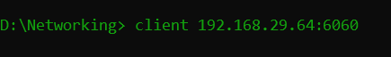

# Client-Server communication using TCP connection 

### If you want to try this out (only Windows user's)

1. Download the zip file in the **download** folder 
2. Extract the files 
3. Open command prompt, locate (using cd) and run the server.exe file

``
Note : turn off 'real time protection' in your settings if it doesnt work  
``

use commands : 

Default port set to **9090**
```cmd
server 
```
or

For custom port 
```cmd
server <port number>
```

 


4. Open another command prompt and run the client.exe file 

use commands : 

Connects to the default port(9090) in a loopback IP

```cmd 
client 
```
or

Connects to a specific port in loopback IP

```cmd 
client loopback <port number>
```


or

```cmd 
client <ip address>:<port number>
```


5. Now, client-server can communicate! 


6. You can end the chat by typing '**leave**' 


